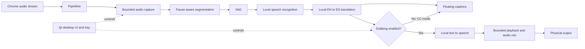

<div align="center">

# OpenDubStream


[](https://github.com/MAlexVR/OpenDubStream/releases)
[](LICENSE)
[](docs/installation.md)
[](pyproject.toml)
[](https://github.com/MAlexVR/OpenDubStream/actions)

**Local English-to-Spanish captions and voice dubbing for Linux.**

[Install](docs/installation.md) · [Release notes](https://github.com/MAlexVR/OpenDubStream/releases) · [Architecture](docs/architecture.md) · [Report a security issue](SECURITY.md)

</div>

Experimental Linux desktop application for **local English-to-Spanish captions and
voice dubbing of a selected Chrome audio stream**, built with Python, Qt and PipeWire.

> **Alpha, not production-ready.** Real sessions have exposed interruptions and latency.
> Offline tests do not prove continuous, low-latency dubbing. Start with captions and
> keep the original audio available. This is not a Chrome extension.

## What it does

- Spanish captions without rerouting or attenuating the original Chrome audio.
- Dubbing or combined captions + dubbing, with original-audio mix controls.
- Independent two-line floating captions, text-size controls and tray shortcuts.
- English/Spanish desktop UI and local inference after explicit model setup.

## Architecture



In **CC mode**, OpenDubStream passively monitors only the selected Chrome stream: it
does not reroute, attenuate, synthesize, or play the original audio. Dubbing temporarily
owns only its routing resources and restores them when the session stops. Read the
[architecture guide](docs/architecture.md) for ownership, queue, and recovery details.

## Install and start

The RPM targets **Fedora 44 x86_64**, with PipeWire, Python 3.12 and a working NVIDIA
CUDA driver. The translation adapter currently requires CUDA; CPU-only operation is
**not supported end to end**. Other distributions and clean-machine installation have
not yet been validated.

1. Read [installation and setup](docs/installation.md), including model-download costs.
2. Install an RPM from [Releases](https://github.com/MAlexVR/OpenDubStream/releases)
   when a prerelease is available. The RPM contains the application, not its ML environment.
3. Run `opendubstream setup` to preview provisioning, then explicitly opt in with
   `opendubstream setup --apply`.
4. Run `opendubstream`, play one English-language Chrome video and select its stream.
   Start with **Spanish captions (CC)**; the original audio should remain unchanged.

Do not run the app or model provisioning with `sudo`.

## Current limitations

- Initial model load and phrase-boundary waiting add latency. Captions are not word-by-word.
- Overload can omit segments. A pause-aware boundary is not a guarantee of a complete sentence.
- Native inference in progress may delay a full stop. Capture and audio recovery need
  validation on each supported desktop/audio setup.
- GNOME/Wayland overlay placement depends on the compositor; the app may use XWayland.
- Diagnostics can include selected device identifiers or displayed text. Scrub reports
  before making them public; never upload audio you do not have permission to share.

## Develop

```bash
python3.12 -m venv .venv
.venv/bin/python -m pip install -e '.[test]'
.venv/bin/python -m pytest -q
```

Two optional historical-receipt checks skip when the private development archive is
absent. Synthetic receipt/ownership regression tests still run.
This lightweight suite also skips tests requiring Qt. Install `requirements/desktop-ui.txt`
in the test environment for those tests. No models or live capture are required by the
unit/integration suite. For a full desktop runtime, follow the installation guide.

- [Architecture](docs/architecture.md)
- [Troubleshooting](docs/troubleshooting.md)
- [Contributing](CONTRIBUTING.md) and [security](SECURITY.md)
- [Build an RPM](packaging/README.md)
- [Third-party notices](THIRD_PARTY_NOTICES.md)

## License

OpenDubStream is licensed under the [MIT License](LICENSE), copyright 2026 Mauricio
Vargas. Included third-party portions retain their notices; the original SVG icon is
CC0. Model and dependency licenses remain separate; see [third-party notices](THIRD_PARTY_NOTICES.md).
